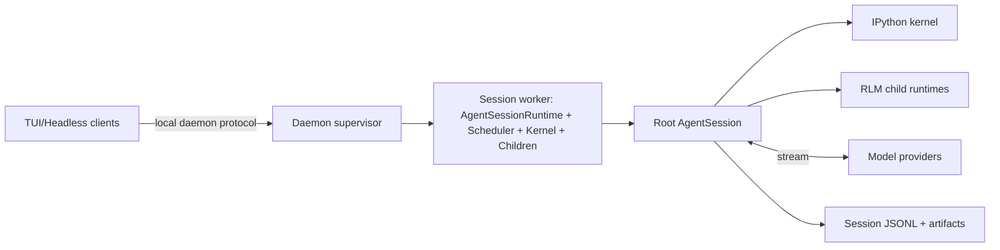

# Repository Inventory — Prime Agent (clone فعلي)

- **المصدر الفعلي**: `git clone --depth 1 https://github.com/PrimeIntellect-ai/prime-agent.git /tmp/prime-agent` (ناجح)
- **الفرع**: `main` · **الإصدار**: `0.7.0` · **آخر push**: 2026‑08‑06 · **اللايسنس**: MIT
- **اللغة**: TypeScript (npm workspaces monorepo) + حزمة Python صغيرة `prime-agent-runtime`
- **النجوم**: ~2539 · **مبني على**: `pi` (pi‑mono) لـ Mario Zechner (badlogic) [✓ code: README.md:104]

> تحذير: مستودع Reference 5 (gemini) وصف prime‑agent كـ "Python RL harness + Docker + MCTS + Vector DB" من خياله. هذا **وهمي**؛ الجدول أدناه من الملفات الفعلية.

## 1. شجرة الحزم (من find الفعلي)

```
prime-agent/
├── packages/
│   ├── agent/          # نواة حلقة الوكيل + transport + state
│   ├── ai/             # تجريد مزوّدات + streaming + MCP
│   ├── coding-agent/   # CLI + TUI + أدوات IPython + session + daemon + docs
│   └── tui/            # واجهة المستخدم الطرفية
├── prime-agent-runtime/ # طبقة Python: rlm shim + harness state + Python skills
├── skills/ (ضمن coding-agent)  # 13 مهارة مدمجة
└── docs/ (ضمن coding-agent)    # 34 ملف توثيق
```

## 2. الملفات الأساسية (Core) — مؤكدة بـ LOC حقيقي

| المسار | LOC | المسؤولية | الأهمية |
|---|---:|---|---|
| `packages/agent/src/agent-loop.ts` | 986 | حلقة الوكيل + نقاط القرار (stop/steer/continue/before‑after‑tool) + AbortSignal | Core |
| `packages/agent/src/agent.ts` | 613 | تطبيق الـ Agent + الاشتراك في الأحداث | Core |
| `packages/agent/src/types.ts` | 421 | `AgentLoopConfig` hooks + `AgentMessage` union + `AgentTool` | Core |
| `packages/agent/src/proxy.ts` | 367 | طبقة transport/وكيل | Support |
| `packages/coding-agent/src/core/agent-session.ts` | 11188 | RLM policy + child creation + registry + usage attribution + goals | Core |
| `packages/coding-agent/src/core/session-manager.ts` | 2324 | تخزين JSONL tree + tree navigation + buildSessionContext | Core |
| `packages/coding-agent/src/core/kernel/index.ts` | 1529 | ZeroMQ + Jupyter framing + execution + comm dispatch | Core |
| `packages/coding-agent/src/core/tools/ipython.ts` | 708 | غلاف أداة IPython + lazy kernel + namespace bootstrap | Core |
| `packages/coding-agent/src/core/rlm-runtime.ts` | 242 | validation لـ `rlm.run` + model discovery + list/delete | Core |
| `packages/coding-agent/src/core/messages.ts` | 484 | أنواع الرسائل الموسّعة (Bash/Custom/Branch/Compaction) | Support |
| `prime-agent-runtime/src/rlm/harness.py` | 819 | **Continual Harness** CRUD + mtime sync + RefinementEvent | Core (نستلهمه) |
| `prime-agent-runtime/src/rlm/skill.py` | 37 | CLI helper لـ Python skills (tyro) | Support |
| `prime-agent-runtime/src/rlm/mcp_base.py` | 331 | قاعدة MCP للـ Python skills | Support |

## 3. مزوّدات النموذج (17 ملف) — `packages/ai/src/providers/`

anthropic · openai‑completions · openai‑responses · openai‑codex‑responses · google · google‑vertex · google‑shared · azure‑openai‑responses · amazon‑bedrock · bedrock‑provider · mistral · cloudflare · github‑copilot · openai‑responses‑shared · register‑builtins · transform‑messages · faux (للاختبار) [✓ code: AGENTS.md:135‑186]

## 4. المهارات المدمجة (13) — `packages/coding-agent/skills/`

agent-message · agent-observe · attach-image · compact · edit · goal · linear · notion · prime-intellect · refine · rlm-heartbeat · skill-creator · websearch [✓ code: find skills/]

## 5. التوثيق (34 ملف) — `packages/coding-agent/docs/`

الأهم للاقتباس: `architecture.md`, `rlm.md`, `rlm-runtime.md`, `long-running-agents.md`, `skills.md`, `session-format.md`, `daemon.md`, `agent-connection.md` [✓ code: ls docs/]

## 6. الاعتماديات (من package.json)

- Runtime: `zeromq` (Jupyter transport)، `@anthropic-ai/sandbox-runtime` (devDep فقط، لا يُستخدم كـ sandbox أمني)، `proper-lockfile`، `undici`، `marked`، `yaml`، `uuid`.
- Build: `biome` (lint/format)، `tsgo` (native TS)، `esbuild`، `husky`.
- Python runtime: `ipykernel`, `prime-agent-runtime`, `tyro` [✓ code: package.json, AGENTS.md]
- **لا توجد** Docker/MCTS/Vector DB/RL trainer في الكود — نفي للادعاء الوهمي.

## 7. الخريطة (Mermaid — من architecture.md)



## 8. نقاط الاهتمام لمشروعنا (mapping سريع)

| ملف prime-agent | يقابله في مشروعنا |
|---|---|
| `rlm/harness.py` | `system/distillation_ledger.jsonl` + `CONSTITUTION.md` (طبقة تكميلية) |
| `session-manager.ts` + `session-format.md` | مسجّل التتبع (trace schema) |
| `long-running-agents.md` (A2A) | `topology_assembler` / حواف الـ graph |
| `types.ts` (AgentLoopConfig hooks) | طبقة orchestration قابلة للتكوين |
| `packages/ai/providers/` | `llm/` (واجهة موحّدة) |
| `skills.md` (skill-creator) | استخراج أنماط → مهارة/entry |
